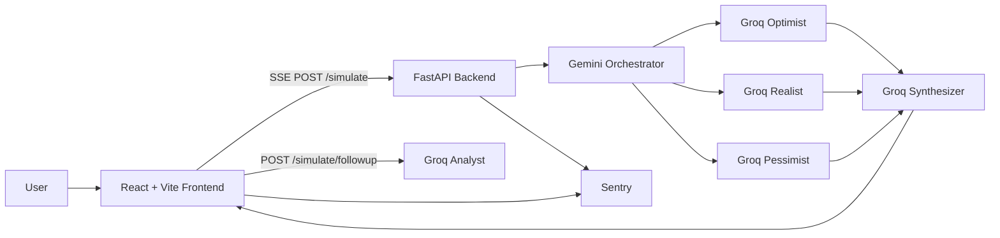

# ForesightX

```text
███████╗ ██████╗ ██████╗ ███████╗███████╗██╗ ██████╗ ██╗  ██╗████████╗██╗  ██╗
██╔════╝██╔═══██╗██╔══██╗██╔════╝██╔════╝██║██╔════╝ ██║  ██║╚══██╔══╝╚██╗██╔╝
█████╗  ██║   ██║██████╔╝█████╗  ███████╗██║██║  ███╗███████║   ██║    ╚███╔╝
██╔══╝  ██║   ██║██╔══██╗██╔══╝  ╚════██║██║██║   ██║██╔══██║   ██║    ██╔██╗
██║     ╚██████╔╝██║  ██║███████╗███████║██║╚██████╔╝██║  ██║   ██║   ██╔╝ ██╗
╚═╝      ╚═════╝ ╚═╝  ╚═╝╚══════╝╚══════╝╚═╝ ╚═════╝ ╚═╝  ╚═╝   ╚═╝   ╚═╝  ╚═╝
```

Every decision rewrites the future. See all versions of it.

[Live Demo](https://foresightx.vercel.app)


## Architecture



## Features

- Cinematic decision input flow with starfield visuals and custom design tokens.
- Five-agent future simulation architecture: orchestrator, optimist, realist, pessimist, synthesizer.
- Server-Sent Events for real-time agent activity with `POST /simulate` and native EventSource-compatible `GET /simulate/stream`.
- Follow-up Analysis streams concise Groq-powered answers against completed simulations.
- Local session history with `localStorage`; no database or auth needed for v1.
- Sentry hooks and admin health route included from the first build.

## Local Setup

```bash
cd ForesightX
copy .env.example .env
```

Backend:

```bash
cd backend
python -m venv .venv
.venv\Scripts\activate
pip install -r requirements.txt
copy .env.example .env
uvicorn app.main:app --reload --port 7860
```

Frontend:

```bash
cd frontend
npm install
npm run dev
```

Open `http://localhost:5173`.

## Environment Variables

| Variable | App | Required | Purpose |
| --- | --- | --- | --- |
| `GROQ_API_KEY` | Backend | yes for AI | Groq agent calls |
| `GROQ_API_KEY_OPTIMIST` | Backend | no | Optional dedicated key for the Optimist agent |
| `GROQ_API_KEY_REALIST` | Backend | no | Optional dedicated key for the Realist agent |
| `GROQ_API_KEY_PESSIMIST` | Backend | no | Optional dedicated key for the Pessimist agent |
| `GROQ_API_KEY_SYNTHESIZER` | Backend | no | Optional dedicated key for the Synthesizer agent |
| `GEMINI_API_KEY` | Backend | yes for AI | Gemini orchestrator calls |
| `GROQ_MODEL` | Backend | no | Defaults to `llama-3.3-70b-versatile` |
| `GROQ_FALLBACK_MODELS` | Backend | no | Comma-separated Groq retry models, defaults to `llama-3.1-8b-instant` |
| `GEMINI_MODEL` | Backend | no | Defaults to `gemini-2.5-flash` |
| `GEMINI_FALLBACK_MODELS` | Backend | no | Comma-separated Gemini retry models |
| `SENTRY_DSN` | Backend | no | Backend exception monitoring |
| `ADMIN_API_KEY` | Backend | yes | Protects `/admin/health` |
| `ALLOWED_ORIGINS` | Backend | yes | JSON list of allowed frontend origins |
| `VITE_BACKEND_URL` | Frontend | yes | FastAPI base URL |
| `VITE_SENTRY_DSN` | Frontend | no | Frontend exception monitoring |
| `SUPABASE_URL` | Optional | no | Reserved for future persistence |
| `SUPABASE_ANON_KEY` | Optional | no | Reserved for future auth/client access |
| `SUPABASE_SERVICE_KEY` | Optional | no | Reserved for future server migrations |

## Deployment

Frontend deploys to Vercel from `/frontend`; set `VITE_BACKEND_URL` and `VITE_SENTRY_DSN` in the Vercel dashboard.

Backend deploys to a public Hugging Face Docker Space from `/backend`; add all backend secrets in Space settings and expose port `7860`.

Supabase is not active in v1. If persistence is added later, SQL migrations will live in `backend/migrations/` and include RLS policies.

## Contributing

Use small, focused commits. Keep environment secrets out of git, update `.env.example` when configuration changes, and run frontend and backend checks before opening a PR.

## License

MIT
